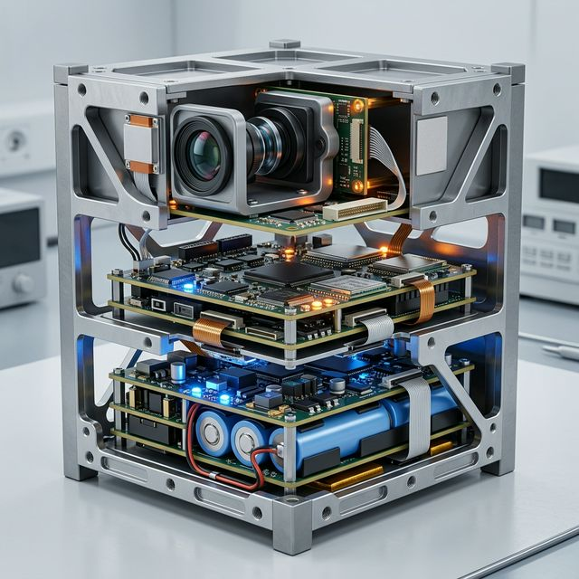
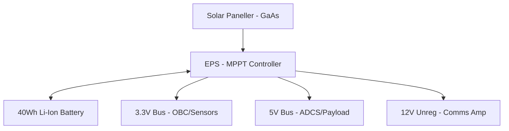
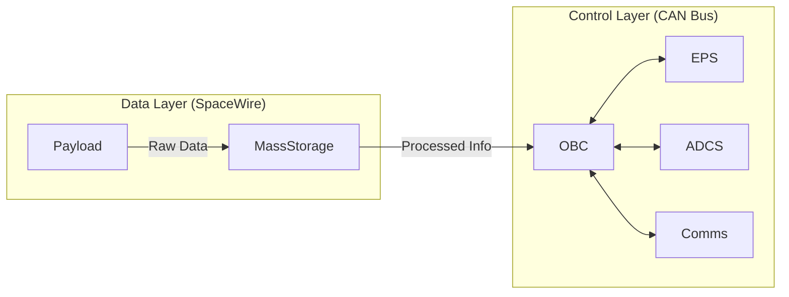

# 🛰️ TerraSense: Küp Uydu (CubeSat) Sistem Mimarisi Tasarımı
### *Milli Uzay Hamlesi Vizyonuyla Geliştirilen 3U Gezgin Platformu*

---

## 1. 📋 Gerekli Girdiler (Required Inputs)
**TerraSense**, aşağıdaki teknik ve operasyonel isterleri karşılamak üzere optimize edilmiştir:
- **Form Faktörü:** 3U Standard CubeSat (10x10x34 cm).
- **Kütle & Güç:** < 4.0 kg | ~15W Ortalama Üretim.
- **Yörünge:** 500 km LEO (Sun-Synchronous).
- **Sensör Kabiliyeti:** 5.0m GSD Multispektral Görüntüleme.

---

## 2. 🌟 Yüksek Düzey Özet (High-Level Summary)
**TerraSense**, kısıtlı hacim ve enerji bütçesi altında maksimum veri işleme kabiliyeti sunan bir 3U Küp Uydu mimarisidir. Proje; **NASA-cFS** tabanlı uçuş yazılımı, **On-board Edge AI** işleme ve hibrit veri yolu (CAN/SpaceWire) mimarisi ile klasik küp uydu tasarımlarındaki veri darboğazlarını ve ısıl sorunları ortadan kaldırır.

---

## 3. 🛠️ Detaylı Çözüm (Detailed Solution)

### A. Donanım ve Mekanik Yerleşim (Hardware Layout)
Uydu, kütle merkezi ve termal stabilite için üç fonksiyonel modüle (Unit) ayrılmıştır:

1.  **Unit 1 (Güç ve Kontrol):** EPS, Batarya Blokları ve ADCS Reaksiyon Tekerlekleri.
2.  **Unit 2 (Beyin ve İletişim):** OBC, Transceiver kartları ve Kitle Bellek.
3.  **Unit 3 (Görev Yükü):** Optik Kamera, Multispektral Sensörler ve GNSS Anteni.

---

## 4. ⚡ Elektronik Mimari ve Donanım Protokolleri

### A. Güç Dağıtım Mimarisi (Power Distribution)
TerraSense, çift seviyeli regüle edilmiş bir güç hattı kullanır:

### B. Veri Yolu ve Protokol Hiyerarşisi

---

## 🧠 5. Teknik Yaklaşım: İleri Seviye Özellikler

### A. Kenar Yapay Zeka (On-board Edge AI)
TerraSense, görüntüleri uzayda işleyerek sadece değerli verileri indirmeyi sağlar:

- **Bulut Eleme:** %70+ bulutlu görüntülerin elenmesi.
- **ROI Tespiti:** Gemi, araç veya arazi değişikliği tespiti.
- **Donanım:** Integrated NPU (Neural Processing Unit) @ 1.5W Peak.

### B. Uçuş Yazılım Yığını (NASA-cFS)
Uydunun yazılım mimarisi, yüksek modülerlik için **NASA Core Flight System (cFS)** tabanlıdır:
- **Hata Yönetimi:** Reset App -> Reset Processor -> Power Cycle döngüsü.
- **RTOS:** FreeRTOS üzerinden gerçek zamanlı görev yönetimi.

---

## ⚠️ 6. Güvenilirlik ve Risk Yönetimi (FMEA)
- **OBC SEU Koruması:** ECC RAM ve Watchdog Timer.
- **ADCS Redundancy:** Manyetik Tork Çubukları ile yedekli yönelim kontrolü.
- **Yazılım Safe Mode:** Düşük enerji durumunda sadece temel haberleşme hattını açık tutan güvenli mod.

---

## 🌍 7. Yer Segmenti ve Operasyonlar (Ground Segment)
- **MCC:** Python tabanlı PDU kod çözücü ve Grafana izleme arayüzü.
- **Haberleşme:**
    - **TT&C:** UHF/VHF (9.6 kbps) - Omni-directional.
    - **Data Downlink:** S-Band (2.0 Mbps) - High-gain Patch.

---

## 🛡️ 8. Regülasyon ve Uyumluluk
- **Uzay Çöpü Azaltma:** 500 km yörünge sayesinde <12 yılda doğal re-entry.
- **ITU Koordinasyonu:** BTK ve IARU üzerinden frekans tescili.

---

## 🔗 Bağlantılar & Demos
*   📽️ **Tanıtım Videosu:** [Drive Linki]
*   📊 **Proje Sunumu:** [Drive Linki]
*   📂 **Tüm Çıktılar Arşivi:** [Drive/GitHub Ana Klasör]

---

  Developed for <b>TUA Astro Hackathon 2026</b> 
  <i>"Gökyüzünün ötesindeki vizyoner fikirler için."</i>

