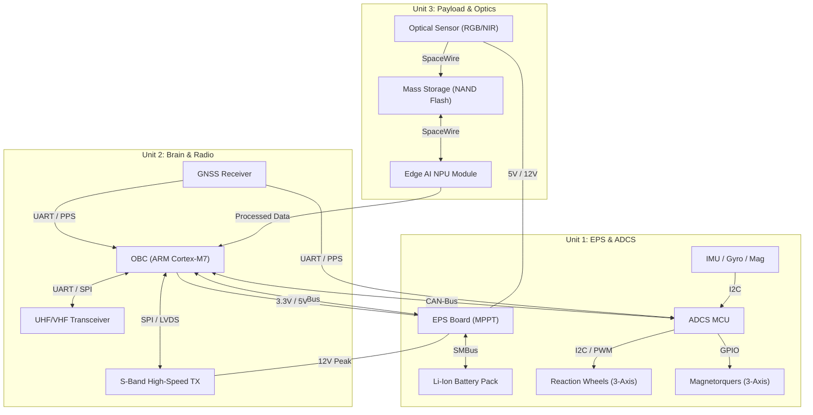
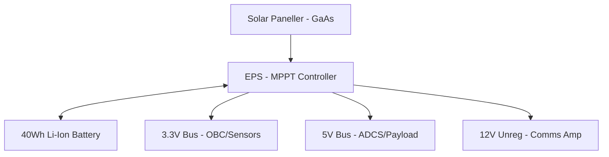

<div align="center">


# 🛰️ Feza-X: Küp Uydu (CubeSat) Sistem Mimarisi Tasarımı
### *Milli Uzay Hamlesi Vizyonuyla Geliştirilen 3U Gezgin Platformu*

[](https://uzay.gov.tr/)
[](https://github.com/topics/aerospace)
[](https://github.com/topics/cubesat)
[](LICENSE)

</div>

---

## 1. 📋 Gerekli Girdiler (Required Inputs)
**Feza-X**, aşağıdaki teknik ve operasyonel isterleri karşılamak üzere optimize edilmiştir:
- **Form Faktörü:** 3U Standard CubeSat (10x10x34 cm).
- **Kütle & Güç:** < 4.0 kg | ~15W Ortalama Üretim.
- **Yörünge:** 500 km LEO (Sun-Synchronous).
- **Sensör Kabiliyeti:** 5.0m GSD Multispektral Görüntüleme.

---

## 2. 🌟 Yüksek Düzey Özet (High-Level Summary)
**Feza-X**, kısıtlı hacim ve enerji bütçesi altında maksimum veri işleme kabiliyeti sunan bir 3U Küp Uydu mimarisidir. Proje; **NASA-cFS** tabanlı uçuş yazılımı, **On-board Edge AI** işleme ve hibrit veri yolu (CAN/SpaceWire) mimarisi ile klasik küp uydu tasarımlarındaki veri darboğazlarını ve ısıl sorunları ortadan kaldırır.

---

## 🏗️ 3. Donanım Mimarisi ve Mekanik Yerleşim (Hardware Architecture)
Feza-X mimarisinin kalbi, modüler ve yedekli donanım katmanlarından oluşur.

### A. Sistem Mimari Şeması (Master Architecture)
Aşağıdaki yüksek çözünürlüklü görsel, Feza-X'in donanım katmanlarını ve teknik arayüzlerini şematize etmektedir:


### B. Master Hidrolik & Elektronik Blok Diyagramı (Full Block Diagram)
Tüm sensör, eyleyici ve işlemcilerin fiziksel bağlantı haritası:



---

## 4. ⚡ Detaylı Elektronik Protokoller

### A. Güç Dağıtım Mimarisi (Power Distribution)
Feza-X, çift seviyeli regüle edilmiş bir güç hattı kullanır:



### B. Donanım Arayüz Protokolleri (Interconnect)
| Protokol | Kullanım Alanı | Hız / Kritiklik |
| :--- | :--- | :--- |
| **SpaceWire** | Payload -> Storage | 200 Mbps |
| **CAN-Bus** | OBC <-> EPS <-> ADCS | 1 Mbps (Kritik Kontrol) |
| **SPI** | OBC -> SD Card / UHF | 20 MHz (Veri Aktarımı) |
| **I2C** | Sensors (IMU/Termal) | 400 kHz (Sistem Sağlığı) |

---

## 🧠 5. Teknik Yaklaşım: İleri Seviye Özellikler

### A. Kenar Yapay Zeka (On-board Edge AI)
Feza-X, görüntüleri uzayda işleyerek sadece değerli verileri indirmeyi sağlar:


- **Bulut Eleme:** %70+ bulutlu görüntülerin elenmesi.
- **ROI Tespiti:** Gemi, araç veya arazi değişikliği tespiti.
- **Donanım:** Integrated NPU (Neural Processing Unit) @ 1.5W Peak.

### B. Uçuş Yazılım Yığını (NASA-cFS)
Uydunun yazılım mimarisi, yüksek modülerlik için **NASA Core Flight System (cFS)** tabanlıdır:
- **Hata Yönetimi:** Reset App -> Reset Processor -> Power Cycle döngüsü.
- **RTOS:** FreeRTOS üzerinden gerçek zamanlı görev yönetimi.

---

## ⚠️ 6. Güvenilirlik ve Risk Yönetimi (FMEA)
- **OBC SEU Koruması:** ECC RAM ve Watchdog Timer.
- **ADCS Redundancy:** Manyetik Tork Çubukları ile yedekli yönelim kontrolü.
- **Yazılım Safe Mode:** Düşük enerji durumunda sadece temel haberleşme hattını açık tutan güvenli mod.

---

## 🌍 7. Yer Segmenti ve Operasyonlar (Ground Segment)
- **MCC:** Python tabanlı PDU kod çözücü ve Grafana izleme arayüzü.
- **Haberleşme:**
    - **TT&C:** UHF/VHF (9.6 kbps) - Omni-directional.
    - **Data Downlink:** S-Band (2.0 Mbps) - High-gain Patch.

---

## 🛡️ 8. Regülasyon ve Uyumluluk
- **Uzay Çöpü Azaltma:** 500 km yörünge sayesinde <12 yılda doğal re-entry.
- **ITU Koordinasyonu:** BTK ve IARU üzerinden frekans tescili.

---

## 🛰️ 9. Misyon Yaşam Döngüsü ve Faz Yönetimi (Mission Lifecycle)
Feza-X görevi, fırlatmadan görevin sonlandırılmasına kadar 5 ana faza ayrılmıştır:

1.  **Fırlatma ve İlk Yörünge Fazı (LEOP):**
    - Ayrılma sonrası 30 dk "sessiz mod".
    - Anten ve güneş paneli açılımı (Burn-wire aktivasyonu).
    - İlk "Beacon" sinyalinin yer istasyonuna iletilmesi.
2.  **Devreye Alma (Commissioning):**
    - Alt sistemlerin (EPS, ADCS, OBC) sağlık kontrolleri.
    - Kamera kalibrasyonu ve Edge AI model doğrulama.
3.  **Nominal Operasyonlar:**
    - Günlük 14-16 yörünge turu.
    - Hedef bölge (Türkiye) üzerinden geçerken görüntüleme ve S-Band veri indirme.
4.  **Uzatılmış Görev / Deney:**
    - Yazılım güncellemeleri ile yeni AI modellerinin test edilmesi.
5.  **Görevin Sonlandırılması (Decommissioning):**
    - Batarya pasivasyonu ve yörünge düşürme manevraları hazırlığı.

---

## 🌡️ 10. Termal Yönetim ve Kontrol (Thermal Engineering)
Uzay ortamının ekstrem sıcaklık farklarına (-50°C ile +80°C) karşı uygulanan stratejiler:
- **Pasif Kontrol:** Alüminyum 7075 şasi üzerine siyah eloksal kaplama ve MLI (Multi-Layer Insulation) battaniyeleri.
- **Aktif Kontrol:** Batarya blokları ve optik sensörler için entegre termistör kontrollü ısıtıcılar (Heaters).
- **Isıl Bütçe:** Solar panel yüzeylerindeki ısıyı şasiye ileten yüksek iletkenlikli termal arayüz malzemeleri (TIM).

---

## 🌌 11. Yörünge Dinamiği ve Kapsama (Orbit & Coverage)
- **Yörünge Tipi:** Güneşe Eşzamanlı Yörünge (SSO).
- **İrtifa:** 500 km | Eğim (Inclination): 97.4°.
- **LTAN (Local Time of Ascending Node):** 10:30 (Sabit ışık açısı ile tutarlı görüntüleme için).
- **Türkiye Kapsaması:** Günde ortalama 2-3 tam geçiş. Ortalama geçiş süresi: 8-10 dakika.

---

## 🚀 12. Gelecek Vizyonu: Feza-X Takımyıldızı
Feza-X-A (Prototip) başarısının ardından hedeflenen yol haritası:
- **Feza-X-B:** Gelişmiş L Bandı radar (SAR) sensörü entegrasyonu.
- **Feza-X-C:** Lazer haberleşme (Optical Comms) ile 1Gbps+ veri hızı.
- **Takımyıldız:** Toplam 12 uydu ile Türkiye üzerinden "Real-time" (15 dk altı) izleme kabiliyeti.

---

## 🇹🇷 13. Milli Uzay Vizyonu ve Stratejik Uyum
Feza-X, Türkiye'nin **10 Yıllık Milli Uzay Programı** hedefleriyle tam uyumlu olarak tasarlanmıştır:
- **Yerlileştirme:** Kritik bileşenlerde ASELSAN, TÜBİTAK UZAY ve ASPİLSAN çözümlerine öncelik veren [Milli Yol Haritası](docs/national_roadmap.md) benimsenmiştir.
- **Teknolojik Bağımsızlık:** Görüntü işleme ve uçuş yazılımı katmanlarında açık kaynaklı ancak milli modifikasyonlara açık mimariler (NASA-cFS tabanlı) kullanılmıştır.
- **Sürdürülebilirlik:** Uzay çöpünü minimize eden pasif de-orbit stratejileri ile küresel standartlara uyum sağlanmıştır.

---

## 🛠️ 14. Somut Çıktılar ve Yazılım Araçları
Proje, mimari dökümantasyonun ötesinde çalıştırılabilir altyapılar sunar:
- **[Telemetri Sözlüğü](communication-arch/telemetry_dictionary.json):** Sistem haberleşme protokolü.
- **[Yörünge Hesaplayıcı](docs/pass_calculator.py):** Python tabanlı yer istasyonu planlama aracı.
- **[MCC Docker Ortamı](Dockerfile):** Görev kontrol merkezini tek komutla kuran altyapı (IaC).
- **[Gereksinim Matrisi (RTM)](docs/requirement_traceability.md):** Mühendislik isterlerinin tam izlenebilirliği.
- **[Görev Kontrol Paneli Mockup](assets/mission_dashboard.html):** Yer segmenti operasyonları için görsel ve interaktif arayüz tasarımı.

---

## 🔬 15. Alt Sistem Teknik Spesifikasyonları (Deep-Dive)
Aşağıdaki tablolar, Feza-X'in kritik bileşenlerinin mühendislik parametrelerini detaylandırır:

### Faydalı Yük (Payload) - Optik Sensör
| Parametre | Değer | Detay |
| :--- | :--- | :--- |
| **GSD (Ground Sample Distance)** | 5.0m @ 500km | Multispektral (R, G, B, NIR) |
| **Swath Width** | 24 km | Tek geçişte kapsama alanı |
| **SNR (Signal-to-Noise Ratio)** | >110 dB | Düşük ışık koşullarında yüksek verim |
| **Data Rate (Raw)** | 480 Mbps | Kamera - Bellek arası SpaceWire hattı |

### Haberleşme (Transceiver) - UHF & S-Band
| Parametre | UHF (TT&C) | S-Band (Mission Data) |
| :--- | :--- | :--- |
| **Frekans** | 437.5 MHz | 2405 MHz |
| **Modülasyon** | GFSK / 9k6 baud | QPSK / 2Mbps |
| **Protokol** | AX.25 / CSP | CCSDS Frame Structure |
| **TX Power** | 30 dBm (1W) | 33 dBm (2W) |

---

## 📝 16. Haberleşme Katmanı ve Yazılım Protokolleri
Feza-X, alt sistemler arası ve yer-uydu haberleşmesi için **CubeSat Space Protocol (CSP)** kullanır:

### CSP Paket Yapısı (Header)
```text
[ Priority (2b) | Source (5b) | Destination (5b) | Destination Port (6b) | Flags (8b) ]
Total: 32-bit Header
```
- **Port 7:** Telemetry Service (PDU format).
- **Port 10:** Command Service (Encrypted HMAC).
- **Port 31:** File Transfer (FP) Service for images.

---

## 🛠️ 17. Yer Destek Ekipmanları ve AIT Altyapısı (GSE)
Uydunun montaj ve test süreçleri için gereken profesyonel laboratuvar mimarisi:

### Elektriksel Yer Destek Ekipmanı (EGSE)
- **Solar Simulator:** Solar panellerin yörünge aydınlanmasını simüle eden AM0 ışık kaynağı.
- **Battery Cycler:** Batarya şarj/deşarj karakteristiği analizi.
- **Hardware-in-the-Loop (HiL):** OBC ve sensörlerin simülasyon ortamında testi.

### Mekanik Yer Destek Ekipmanı (MGSE)
- **ISO 7 Cleanroom:** Partikül arındırılmış montaj alanı.
- **Vibration Jig:** 3-eksenli titreşim tablası adaptörleri.
- **Thermal Vacuum Chamber (TVAC):** -60°C / +90°C vakum ortamı.

---

## 📂 18. Proje Dizini ve Dosya Mimarisi
Reposu içindeki dosyaların görev ve hiyerarşi rehberi:

```text
📁 Feza-X-CubeSat-Architecture
├── 📁 assets/               # Görsel varlıklar, banner ve MCC mockup
├── 📁 communication-arch/    # Telemetri sözlüğü ve Link Budget dökümanları
├── 📁 docs/                 # Teknik derinlik, FMEA, AIT ve RTM dosyaları
├── 📁 hardware-layout/      # 3U yerleşim planları ve alt sistem spekleri
├── 📄 Dockerfile            # Görev kontrol merkezi IaC dökümanı
├── 📄 README.md             # Master dökümantasyon (Ana doküman)
└── 📄 LICENSE               # MIT Lisansı
```

---

## 🔗 Bağlantılar & Demos
*   📽️ **Tanıtım Videosu:** [Drive Linki]
*   📊 **Proje Sunumu:** [Drive Linki]
*   📂 **Tüm Çıktılar Arşivi:** [Drive/GitHub Ana Klasör]

---
<div align="center">
  Developed for <b>TUA Astro Hackathon 2026</b><br/>
  <i>"Gökyüzünün ötesindeki vizyoner fikirler için."</i>
</div>
