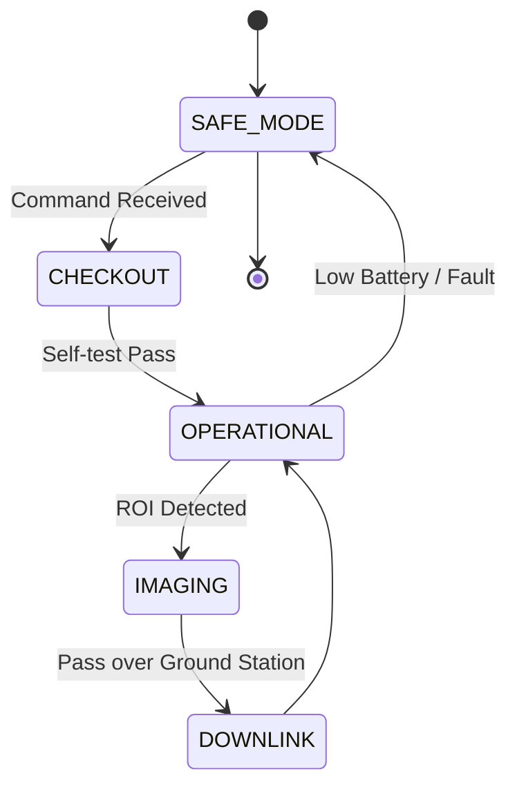

# 🎬 Feza-X: Concept of Operations (CONOPS)

## 1. Mission Phases
1.  **Launch & Deployment:** Rocket separation, antenna deployment (monopoles), initial stabilization.
2.  **LEOP (Launch and Early Orbit Phase):** Subsystem health check, solar panel charging.
3.  **Commissioning:** ADCS calibration, sensor checkout.
4.  **Operational Phase:** Earth imaging at specific ROIs (Regions of Interest).
5.  **Downlink Phase:** Pushing processed data to Ground Station.
6.  **Decommissioning:** Orbit decay and reentry (End of life).

## 2. System State Machine

## 3. Power Duty Cycle
- **Orbit Time:** ~95 mins.
- **Eclipse Time:** ~35 mins.
- **Active Imaging:** ~5 mins per orbit (Peak power).
- **Downlink:** ~10 mins per orbit.
