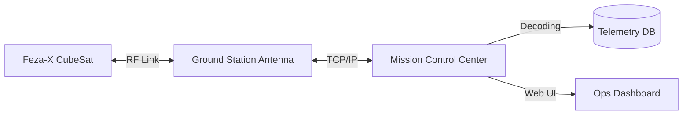

# 🌍 Feza-X: Ground Segment & MCC Interface

The Ground Segment architecture for managing the Feza-X CubeSat mission.

## 1. Mission Control Center (MCC) Architecture
- **Infrastructure:** Centralized server for TLE (Two-Line Element) tracking and pass prediction.
- **Software Stack:** Python-based PDU (Protocol Data Unit) decoder + InfluxDB for telemetry storage + Grafana for real-time health monitoring.

## 2. Telemetry & Command Pipeline

## 3. Data Processing Levels
- **Level 0:** Raw frames from S-Band (CCSDS formatted).
- **Level 1:** Radiometrically corrected images.
- **Level 2:** Georeferenced products (GeoTIFF).
- **Level 3:** Change detection or specific AI-driven analysis.

## 4. Operational Dashboard Features
- Real-time battery voltage & thermal status.
- Satellite position on 2D/3D map.
- Command queue manager (Uplink window).
